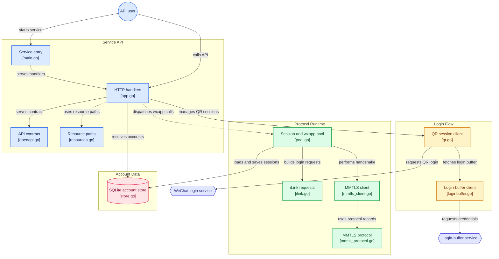

# YYB_GO
应用宝协议

```mermaid
%% Generated by https://gitdiagram.com/supernaiba/yyb_go
flowchart TD

subgraph group_service["Service API"]
  node_main["Service entry<br/>[main.go]"]
  node_http["HTTP handlers<br/>[app.go]"]
  node_api_spec["API contract<br/>[openapi.go]"]
  node_resources["Resource paths<br/>[resources.go]"]
end

subgraph group_login["Login Flow"]
  node_qr["QR session client<br/>[qr.go]"]
  node_login_buffer["Login-buffer client<br/>[loginbuffer.go]"]
end

subgraph group_protocol["Protocol Runtime"]
  node_pool["Session and wxapp pool<br/>[pool.go]"]
  node_ilink["iLink requests<br/>[ilink.go]"]
  node_mmtls["MMTLS client<br/>[mmtls_client.go]"]
  node_mmtls_protocol["MMTLS protocol<br/>[mmtls_protocol.go]"]
end

subgraph group_data["Account Data"]
  node_store[("SQLite account store<br/>[store.go]")]
end

node_user(("API user"))
node_wechat_qr{{"WeChat login service"}}
node_login_service{{"Login-buffer service"}}

node_user -->|"starts service"| node_main
node_main -->|"serves handlers"| node_http
node_user -->|"calls API"| node_http
node_http -->|"serves contract"| node_api_spec
node_http -->|"manages QR sessions"| node_qr
node_qr -->|"requests QR login"| node_wechat_qr
node_qr -->|"fetches login buffer"| node_login_buffer
node_login_buffer -->|"requests credentials"| node_login_service
node_http -->|"resolves accounts"| node_store
node_http -.->|"dispatches wxapp calls"| node_pool
node_pool -->|"loads and saves sessions"| node_store
node_pool -->|"builds login requests"| node_ilink
node_pool -->|"performs handshake"| node_mmtls
node_mmtls -.->|"uses protocol records"| node_mmtls_protocol
node_http -.->|"uses resource paths"| node_resources

click node_main "https://github.com/supernaiba/yyb_go/blob/main/yyb_go/cmd/yyb-go/main.go"
click node_http "https://github.com/supernaiba/yyb_go/blob/main/yyb_go/internal/httpapi/app.go"
click node_api_spec "https://github.com/supernaiba/yyb_go/blob/main/yyb_go/internal/httpapi/openapi.go"
click node_resources "https://github.com/supernaiba/yyb_go/blob/main/yyb_go/internal/httpapi/resources.go"
click node_qr "https://github.com/supernaiba/yyb_go/blob/main/yyb_go/internal/qr/qr.go"
click node_login_buffer "https://github.com/supernaiba/yyb_go/blob/main/yyb_go/internal/protocol/loginbuffer.go"
click node_pool "https://github.com/supernaiba/yyb_go/blob/main/yyb_go/internal/protocol/pool.go"
click node_ilink "https://github.com/supernaiba/yyb_go/blob/main/yyb_go/internal/protocol/ilink.go"
click node_mmtls "https://github.com/supernaiba/yyb_go/blob/main/yyb_go/internal/protocol/mmtls_client.go"
click node_mmtls_protocol "https://github.com/supernaiba/yyb_go/blob/main/yyb_go/internal/protocol/mmtls_protocol.go"
click node_store "https://github.com/supernaiba/yyb_go/blob/main/yyb_go/internal/store/store.go"

classDef toneNeutral fill:#f8fafc,stroke:#334155,stroke-width:1.5px,color:#0f172a
classDef toneBlue fill:#dbeafe,stroke:#2563eb,stroke-width:1.5px,color:#172554
classDef toneAmber fill:#fef3c7,stroke:#d97706,stroke-width:1.5px,color:#78350f
classDef toneMint fill:#dcfce7,stroke:#16a34a,stroke-width:1.5px,color:#14532d
classDef toneRose fill:#ffe4e6,stroke:#e11d48,stroke-width:1.5px,color:#881337
classDef toneIndigo fill:#e0e7ff,stroke:#4f46e5,stroke-width:1.5px,color:#312e81
classDef toneTeal fill:#ccfbf1,stroke:#0f766e,stroke-width:1.5px,color:#134e4a
class node_main,node_http,node_api_spec,node_resources,node_user toneBlue
class node_qr,node_login_buffer toneAmber
class node_pool,node_ilink,node_mmtls,node_mmtls_protocol toneMint
class node_store toneRose
class node_wechat_qr,node_login_service toneIndigo
```
